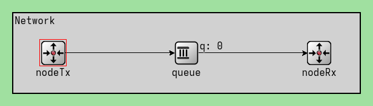
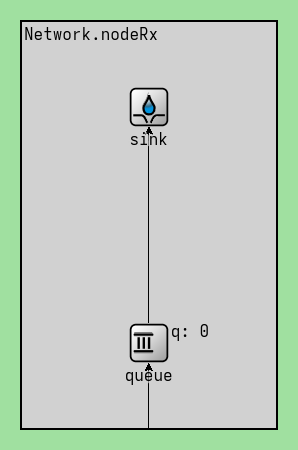
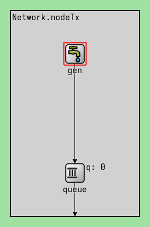
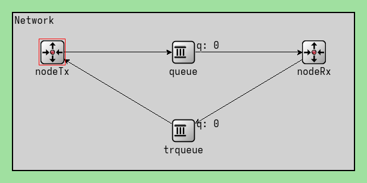
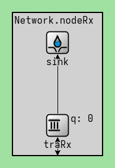
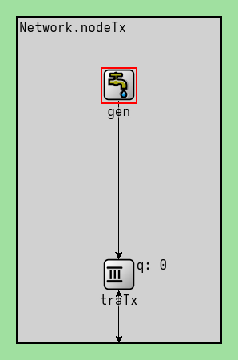

# Analísis de flujo y congestión en redes utilizando simulación discreta 

## Resumen
Descirbe lo que se va a encontrar nuestro lector, si lee nuestro trabajo. 
Prestenar el problema a trabajar, de que manera la trabajamos, pequena idea de solucion y describir un poco la estrcutura. 

El visual de bitbucket para MarkDown, no es el mejor, recomendamos verlo en otro lugar. 
Lo que se recomienda es utilizar pandoc y pasarlo a pdf, ya que escribimos un titulo que sin un convertidor como latex o pandoc no se puede observar, para hacerlo hay que descargarlo nuestro archivo .m (junto con la carpeta de las imagenes),y ejecutar: `pandoc Informe.md -o informe.pdf --pdf-engine=xelatex` por comodidad tambien lo dejamos en el repositorio. 

## Integrantes
  - Guerrero Diego
  - Gonzalez Juan Pablo
  - Madero Ismael
  - Pellegrino Milena

## Índice 

1. [Introducción](#introducción)
2. [Experimento 1](#experimento-1)
   - [Caso de estudio 1](#caso-de-estudio-1)
   - [Caso de estudio 2](#caso-de-estudio-2)
   - [Análisis](#análisis)
   - [Preguntas](#preguntas)
3. [Experimento 2](#experimento-2)
   - [Algoritmo implementado](#algoritmo-implementado)
   - [Caso de estudio 1](#caso-de-estudio-1-1)
   - [Caso de estudio 2](#caso-de-estudio-2-1)
   - [Preguntas](#preguntas-1)

4. [Conclusiones](#conclusiones)
5. [Referencias](#referencias)
6. [Anexo](#anexo)

## Introducción

En este laboratorio nos centramos en la capa de transporte, con el objetivo de analizar el tráfico de red bajo tasas de datos acotadas y tamaño de buffers limitados, ademas de diseñar y proponer diferentes soluciones de control de congestión y flujo. 

Para poder realizar esto usamos Omnet++, una bibloteca con un marco de simulación en C++ destinado principalmente a la creación de simuladores de red, nosotros lo utilizamos para poder generar estos modelos de red que posteriormente analizamos. 

### Esquema de nuestra red

El esquema de red utilizado es bastante simple, que consta de tres elementos principales: 
1. nodeTx: nodo generador, es el que genera los paquetes de datos y los envía al siguiente componente (queue). 
2. queue: cola de paquetes, es un buffer donde los paquetes que llegan son almacenados hasta que se envía al nodo receptor. Sirve para, por ejemplo, si hay congestión, los paquetes se puedan quedar esperando en un lugar, sin que se pierdan. 
3. nodeRx: sink, el nodo receptor, es el encargado de recibir los datos que fueron enviados desde el nodo generador, los recibe una vez que fueron pasados por la queue.

Además cabe aclarar que internamente cada nodo cuenta con buffer (ver imágenes de abajo) con el objetivo de simular un poco mejor el comportamiento de un red **real**, por ejemplo para simular un retardo realista antes de que el paquete sea transmitido. 

|  |  |
|----------|----------|
|  |  |

### Flujo y congestión 
Como dijimos anteriormente en la parte de [Introducción](#introducción) queremos diseñar y proponer soluciones de control de congestión y de control de flujo; para esto damos una explicación breve de ambos conceptos para que se pueda entender uno de los objetivos del trabajo:

- **Control de flujo:** Es un mecanismo que regula la velocidad de transmisión de datos entre un emisor y un receptor para evitar sobrecargar los dispositivos y asegurar una comunicación eficiente. EL objetivo es evitar que el emisor envíe más datos de los que el receptor puede procesar, ya que esto podría causar pérdida de información. Para evitar que suceda esto se utilizan algoritmos (vistos en el teórico) que ajustan la velocidad de transmisión según la capacidad del receptor. 

- **Control de congestión:** Es una sobrecarga de la red. Ocurre cuando la cantidad de datos que circulan por la red supera la capacidad de la red, lo que provoca retrasos o peor aún la pérdida de paquetes. Esto se suele solucionar con técnicas como el control de tráfico (que lo que hacen en esencia es limitar la cantidad de datos emitidos) o alguna optimización de enrutamiento. 

### Simulación discreta
Para los análisis de los experimentos (tanto del experimento 1, como del experimento 2) realizamos simulaciones discretas, es decir, los eventos ocurren en momentos específicos y el tiempo ocurre en pasos discretos, nosotros utilizamos Omnet++. Hacerlo de esta manera nos permite evaluar el desempeño de una red sin la necesidad de tenerla físicamente.

# Experimento 1

Primeramente recordemos los parámetros de nuestra red, para este experimento:
Recordemos que en el archivo .ini se encuentran estos parámetros, obviamente se pueden modificar, pero los experimentos los fijamos con los siguientes: 

- Tamaño de los paquetes: 12500 bytes 
- Tamaño de los buffers: 
   - nodeRx: 200
   - nodeTx: 2000000 
   - queue (buffer del medio): 200
- Intervalo de generación: exponential(0.001), es decir, se elige un numero de la distribución exponencial con media 0.001 

- Desde el nodeTx hacia el nodo intermedio: 
   - Velocidad de tasa de datos: 1Mbps
   - Delay: 100us

Luego tenemos los parametros de el datarate y los delay de los demas nodos, que son lo que cambia en nuestros casos de estudios. (ambos datos se especifican en la parte de los casos de estudio.)

El objetivo de este experimento es poder analizar el comportamiento de la red al variar el intervalo de generación (entre 0.1s y 1.0s) esto es común en ambos experimentos. Lo que nosotros observamos para poder hacer el analísis es: 
1. El uso de las tres queue 
2. Relación entre carga transmitida y carga recibida (paquetes/segundo).
3. En el caso de que haya pérdidas, medirlas y analizarlas, a través de gráficos. 

## Caso de estudio 1

Primeramente recordemos la tasa de datos para este caso de estudio: 
- `queue.out --> { datarate = 0.5Mbps; } --> sink.in;` es decir, nuestra tasa de datos, desde el nodo intermedio hacia el sink es de 0.5Mbps
- `queue.out --> { datarate = 0.5Mbps; } --> nodeRx.in;` 

## Caso de estudio 2
Primeramente recordemos la tasa de datos para este caso de estudio:
- `queue.out --> { datarate = 1Mbps; } --> sink.in;` es decir, nuestra tasa de datos es de 1Mbps, el doble que el caso de estudio 1. 
- `queue.out --> { datarate = 0.5Mbps; delay = 100us; } --> nodeRx.in;`, es decir, es la misma tasa de datos (0.5 Mbps) del caso de estudio 1, pero ahora se agrega un retardo de 100 µs en la transmisión hacia NodeRx

## Analisís
Para poder analizar este caso de estudio, se hicieron diferentes graficas, a partir de los datos extraidos en las simulaciones con los parametros establecidos anteriormente; además para cada caso se tomaron las medidas con intervalos de generación de: 0.1, 0.15, 0.25, 0.39 y 1. 

### Tamaño de buffers
| Caso | 0.1 | 0.15 | 0.25 | 0.39 | 1   |
|----|----|----|----|----|----|
| 1 | /buffers.png) | /buffers.png) | /buffers.png) | /buffers.png) | /buffers.png) |
| 2 | /buffers.png) | /buffers.png) | /buffers.png) | /buffers.png) | /buffers.png) |

### Carga útil vs carga ofrecida 
| Caso | 0.1 | 0.15 | 0.25 | 0.39 | 1   |
|----|----|----|----|----|----|
| 1 | /útil_vs_ofrecida.png) | /útil_vs_ofrecida.png) | /útil_vs_ofrecida.png) | /útil_vs_ofrecida.png) | /útil_vs_ofrecida.png) |
| 2 | /útil_vs_ofrecida.png) | /útil_vs_ofrecida.png) | /útil_vs_ofrecida.png) | /útil_vs_ofrecida.png) | /útil_vs_ofrecida.png) |

| Caso |  |
|----|----|
| 1 |  | 
| 2 |  |

### Pérdida de paquetes en queue
En este gráfica analizamos la relación entre el tamaño del buffer de la cola y los descartes
| Caso | 0.1 | 0.15 | 0.25 | 0.39 | 1   |
|----|----|----|----|----|----|
| 1 | /pérdida_con_queue.png) | /pérdida_con_queue.png) |  |  |  |
| 2 | /pérdida_con_queue.png) | /pérdida_con_queue.png) |  |  |  |

### Pérdida de paquetes 
En este gráfica analizamos la cantidad de pérdida de paquetes a través del tiempo.
| Caso | 0.1 | 0.15 | 0.25 | 0.39 | 1   |
|----|----|----|----|----|----|
| 1 | /pérdida_de_paquetes.png) | /pérdida_de_paquetes.png) |  |  |  |
| 2 | /pérdida_de_paquetes.png) | /pérdida_de_paquetes.png) |  |  |  |

### Pérdida de paquetes 
En este gráfica analizamos la relación acumulativa entre los paquetes utilizados contra los paquetes generados
| Caso | 0.1 | 0.15 | 0.25 | 0.39 | 1   |
|----|----|----|----|----|----|
| 1 | /relación_paquetes_gen_vs_used.png) | /relación_paquetes_gen_vs_used.png) |  |  |  |
| 2 | /relación_paquetes_gen_vs_used.png) | /relación_paquetes_gen_vs_used.png) |  |  |  |

## Preguntas

**¿Qué diferencia observa entre el caso de estudio 1 y 2? ¿Cuál es la fuente limitante en cada uno? Investigue sobre la diferencia entre control de flujo y control de congestión (ver Figura 6-22 del libro Tanenbaum).**

Después de hacer las mediciones y analizar cada caso, podemos ver que no hay mucha diferencia entre el caso 1 y el caso 2; esto es algo que podiamos intuir ya que en ambos casos nuestro sistema de red que se usa es practicamentela misma, con un cambio minimo en el cuello de botella. 

Luego observando la gráfica de tamaño de buffer, junto con los de pérdidas de paquetes, podemos encontrar una relación que cuando el buffer se llena se empiezan a perder paquetes, esto ocurre así porque la red no le queda otro camino, tiene los buffers llenos y no tiene otro camino para mandar los paquetes, entonces no le queda otra opción que descartarlos. 

También obersamos que la perdida de paquetes a lo largo del tiempo tiene una forma lineal, en el caso del intervalo de generación 0.1 y más o menos lineal en los demás, esto ocurre porque nuestra simulación es sin eventos fluctuantes, cuando se llena el buffer, se empiezan a perder los paquetes linealmente. 

Luego viendo los diferentes cambios entre los intervalo de generación que nosotros elegimos para el analisis, podemos ver como  "mejoran" (con mejorar nos referimos a que tienen menos paquetes pérdidos y menor delay entre los envíos.) En las gráficas observamos que a partir del 0.25 se dejaban de perder significativamente paquetes. 

(la pregunta de la diferencia entre control de flujo y control de congestión fue respondida en la parte introductorio del informe.)

En resumen, lo que queriamos estudiar es la perdida de paquetes, que como dijimos anteriormente se puede dar por problema de flujo o problema de congestión. En nuestro caso de estudio 1, si observamos el nodeRx, como si fuera el receptor de la transferencai de paquetes, la pérdida ocurre en esa instancia, por lo que lo catalogaríamos como un problema de flujo; en cambio, en nuestro caso de estudio 2, nuestra queue del medio tiene una tasa de transferencia más chica en el out que en el in, por lo tanto el gate in causa una pérdida de paquetes un poco antes de entrar al nodeRx, aunque esta diferencia es muy sutil. 

# Experimento 2

Nuestro siguiente objetivo, fue diseñar un sistema de control de flujo y congestión de tal manera que se pueda evitar la périda de datos por saturación de los buffers, algo que vimos que ocurre en nuestro experimento anterior. 

Primeramente se modifico un poco el sistema de red. Ahora está formada de la siguiente manera:

|  |  |
|----|----|
|  | **Nuestra red principal:**  - **nodeTx**: Nodo transmisor que conecta hacia dos colas:   - Envía paquetes a `queue` (red principal)   - Recibe desde `trqueue`  - **queue**: Cola intermedia entre nodeTx y nodeRx:   - Simula la red principal   - **trqueue**: Cola paralela para control de trafico:   - La necesitamos para enviar paquetes entre `nodeRx` y `nodeTx`   - **nodeRx**: Nodo receptor:   - gracias a la `trqueue` puede "vovler hacia atras" | | 
|  | **Nodo receptor:**  - **traRx**: Cola de recepción, donde se van almacenando los paquetes que entran.   - **sink**: Destino final de esos paquetes, como si fuera el recolector de los paquetes entrantes. | | 
|  | **Nodo transmisor:**  - **traRx**: Cola de recepción, donde se van almacenando los paquetes que entran.   - **gen**: Generador de paquetes, crea los paquetes que se enviarán. | | 

## Algoritmo implementado 
Nuestro algoritmo lo que hace es que el transportRx guarda en una cola los ultimos delaySize(.ini) delays y los va promediando.
Lo que hacemos es agarrar el delay actual y calcular la diferencia de porcentaje entre el delay contra el promedio de delays si este porcentaje es mayor al modulo de un errPercent(.ini), si se da entonces envia un mensaje de solicitud de modificación de serviceTime del nodo transportTx.
transportTx esta programado para ignorar una cantidad ignore (.ini) de paquetes luego de recibir uno, esto porque hasta que se actualice la cola de delays va a tardar lo suyo.

## Caso de estudio 1 y caso de estudio 2 

Obviamente los casos de estudio son utilizando los mismo parametros que en el los casos de estudios anteriores. 

Observemos y analizemos las simulaciones: 

### Tamaño de buffers
| Caso | 0.1 | 0.15 | 0.25 | 0.39 | 1   |
|----|----|----|----|----|----|
| 1 | /(0.1)/buffers.png) | /(0.15)/buffers.png) | /(0.25)/buffers.png) | /(0.39)/buffers.png) | /(1)/buffers.png) |
| 2 | /(0.1)/buffers.png) | /(0.15)/buffers.png) | /(0.25)/buffers.png) | /(0.39)/buffers.png) | /(1)/buffers.png) |

### Carga útil vs carga ofrecida
En este gráfica analizamos la cantidad de pérdida de paquetes
| Caso | 0.1 | 0.15 | 0.25 | 0.39 | 1   |
|----|----|----|----|----|----|
| 1 | /(0.1)/útil_vs_ofrecida.png) | /(0.15)/útil_vs_ofrecida.png) | /(0.25)/útil_vs_ofrecida.png) | /(0.39)/útil_vs_ofrecida.png) | /(1)/útil_vs_ofrecida.png) |
| 2 | /(0.1)/útil_vs_ofrecido.png) | /(0.15)/útil_vs_ofrecida.png) | /(0.25)/útil_vs_ofrecida.png) | /(0.39)/útil_vs_ofrecida.png) | /(1)/útil_vs_ofrecida.png) |

| Caso |  |
|----|----|
| 1 | /útil_vs_ofrecida.png) | 
| 2 | /útil_vs_ofrecida.png) |

## Preguntas

**¿Cómo cree que se comporta su algoritmo de control de flujo y congestión4? ¿Funciona
para el caso de estudio 1 y 2 por igual? ¿Por qué?**

Nuestro acf analiza los delays de los paquetes llevando un promedio de los ultimos n paquetes, de esta manera puede determinar si el último paquete recibido demoro notablemente mas o menos que el promedio de los anteriores n paquetes:
Si es el caso entonces se envía al transportTx un porcentaje de aumento o decremento de serviceTime mediante un paquete.
Cuando transportTx recibe dicho paquete puede ignorarlo (si recientemente acepto uno de estos paquetes) o aceptarlo.
Si lo acepta entonces suma el porcentaje solicitado a un campo de su clase llamado timeModifier el cual luego se multiplica por el serviceTime.
De esta manera modificando la cadencia de paquetes enviados.

Utilizando las mismas justificaciones del experimento 1 y analizando las graficas, no se encuentran grandes diferencias entre el caso de estudio 1 y el caso de estudio 2.

Cabe aclarar que en nuestra simulación no se modeló la caída de red, por lo que los paquetes que no llegaron al nodo receptor al finalizar la simulación no se consideran pérdidos, sino simplemente no se contabilizan por haber quedado en transito, pero no fueron dropeados, ya que nunca se llego a llenar el buffer, esto es así ya que nuestra simulación tiene un tiempo limitado, por este motivo se ven así las graficas. 

## Conclusiones

Logramos hacer un acf para poder solucionar el problema de control de flujo y control de congestión, aunque no es perfecto y hay varios aspectos que se pueden mejorar, por ejemplo viendo cuales seria los parametros ideales para diferentes tipos de red, o modificarlo para que no haya tanto delay entre paquetes, ademas de tratar de llevar al maximo la capacidad de la red, en la que nosotros hicimos las simulaciones y realizamos estos algoritmos capaz no se ve tan afectada, pero en redes mas grandes los cambios serian significativos. 

## Referencias

- [Documentación oficial de Omnet++](https://omnetpp.org/documentation/)
- [Manual de Omnet++](https://doc.omnetpp.org/omnetpp5/manual/)
- [Introducción a Omnet++ y c++ (filminas)](https://drive.google.com/file/d/1xx5pSrQE5PUczFH7eUAPKU23-dclSdeF/view)
- [Introducción a Omnet++ y c++ (video)](https://www.youtube.com/watch?v=hgRW5rK-CDE&t=1616s)
- [Graficas en Omnet++ con Python y Notebooks](https://www.youtube.com/watch?v=yL1gf04E2_E)
- [Curva de Carga Ofrecida vs Carga Util](https://www.youtube.com/watch?v=W8r8zSPjeAs)
- [Graficar en google colab](https://colab.research.google.com/drive/1wOr1jP7-s076qyJl7gxgQ63cqiEYJ8g0?usp=sharing)
- [Estructura de un informe](https://www.youtube.com/watch?v=yq8zjLZABe0)

Cabe aclarar que vimos el video sobre la estructura del informe, pero solo incluimos algunos apartados como abstract, referencias, introducción. Para los otros nos tomamos la libertad de divididir el informe en secciones de exp1 y exp2 y luego un apartado de conclusiones general. (en el video se proponia que en la introducción pongamos el análisis de los problemas en el caso1 y caso2, en una sección método se explique la tarea de diseño, etc; nosotros decidimos hacerlo de esta manera ya que nos parecio un poco mas prolijo y mas ordenado a la hora en la que alguien lo tenga que leer; igualmente tenemos en cuenta que esto puede ser subjetivo y podriamos haber seguido la alineación propuesta por la catedra). 

## Anexo

Creemos pertinente aclarar que al no tener el tiempo deseado para la realización del lab, para la última parte del laboratorio nos organizamos dividiendo las tareas principales, siempre comunicandonos y entendiendo en cada momento lo que hacia el otro compañero. @IsmaelMadero se encargo de programar el diseño de nuestro algoritmo, @JuanPGonzalez fue el encargado de realizar las simulaciones y realizar las graficas (algo que capaz no se vea en el historial de commits), @MilenaPellegrino, se encargo de realizar el informe y analizar las graficas y @DiegoGuerrero se encargo de debuggear. A su vez hicimos mucho pairprogramming, tanto en las clases presenciales como remotamente.

Hemos utilizado diferentes herramientas de Inteligencia Artificial a lo largo del laboratorio, en diferentes ocasiones y usos. 

1. Primeramente utilizamos [ChatGPT](https://chatgpt.com/) para entender algunas partes del código proporcionado por la cátedra, que al leer la documentación no nos quedaba del todo claro.

   1. 
      - **Prompt**: Podrías explicarme qué es lo que hace `par("algo")` en OMNeT++.
      - **Respuesta**: *Lo de `par("nombre")` significa que estás accediendo a un parámetro del módulo en OMNeT++. `par("nombre")` te da acceso al valor de un parámetro definido en el archivo .ned del módulo. Es como una variable configurable desde afuera del código C++.*
      - **Verificación**: Lo verificamos observando el código y viendo que lo que se encontraba adentro del paréntesis efectivamente era un parámetro en el archivo `.ned`. Luego de leer la respuesta de ChatGPT, volvíamos a leer la documentación con un poco más de conocimiento para poder entenderlo del todo.

   2. 
      - **Prompt**: ¿Podrías explicarme qué es lo que hace `exponential(0.001)` en el contexto de OMNeT++?
      - **Respuesta**: *Cuando escribís `exponential(0.001)` en OMNeT++, estás diciendo: "Quiero que este valor se genere aleatoriamente siguiendo una distribución exponencial con media 0.001 segundos (o sea, 1 milisegundo)."*
      - **Verificación**: En este caso lo preguntamos porque no encontrábamos fácilmente información sobre el funcionamiento de `exponential(0.001)`. Encontramos un [manual](https://doc-omnetpp-org.translate.goog/omnetpp/manual/?_x_tr_sl=en&_x_tr_tl=es&_x_tr_hl=es&_x_tr_pto=tc) sobre OMNeT++ pero cuando explicaba lo de `exponential` era bastante vago. Para verificar, probamos qué hacía y leímos el código para ver si tenía sentido.

   3. 
      - **Prompt**: ¿Estamos hacineod un proyecto en omentpp, segun la documentación de omentpp esto es lo que hace la función scheduleAt (insertamos una imágen de la doc) lo que yo entiendo es que scheduleAt es un mensaje para el mismo proceso que lo ejecuta esto es correcto?
      - **Respuesta**: *¡Exactamente! 🙌 En OMNeT++, scheduleAt(tiempo, mensaje) agenda un evento (mensaje) para que sea entregado al mismo módulo que lo programó, en el momento tiempo del reloj de simulación*
      - **Verificación**: Acá no verificamos muchos, ya que utilizamos la herramienta para poder ver si lo que habiamos leído sobre [scheduleAt](https://doc.omnetpp.org/omnetpp/apiclassomnetpp_1_1cSimpleModulehtml#a97c57271ca2fc95225ed8514750cac27)  era correcto o estabamos mal encaminados.

2. Utilización de [Gemini](https://gemini.google.com/), lo usamos al utilizar [Google Colab](https://colab.google/) muchas veces teníamos varios errores al hacer las gráficas, y la explicación del error que tiraba python o la librería que usabamos era muy vaga y no llegabamos a entenderla, por lo tanto como Colab tiene incorporado Gemini, lo utilizamos para que nos explique mejor estos errores: 
   1. 
      - **Prompt**: Porfavor, podrías explicarme este error: [insertabamos el error] ejemplo: `AttributeError: 'float' object has no attribute 'split' `
      - **Respuesta**: *The error message AttributeError: 'float' object has no attribute 'split' indicates that you are trying to apply the split() method to a float object, but this method is only available for strings. This is happening because time_gen, time_queue, time_sink, buffer_gen, buffer_queue, and buffer_sink variables are already lists of floats based on the Global variables provided. The line of code time_gen[0].split() tries to access the first element of time_gen, which is a float, and then apply the split() method to it. Since floats don't have a split() method, this causes an AttributeError.*
      - **Verificación**: La verificación era hacer lo que nos decía y ver si tenía razón. Cabe aclarar que para la mayoría no era 100% correcto, pero nos tiraba una idea de cual era el problema del error y pensando un poco se solucionaba. 

3. Utilización de [Copilot](https://copilot.microsoft.com), lo usamos para escribir el informe, ya que utlizamos chatGPT para tratar de hacer items dentro de tablas, pero al explicarme lo que queriamos chatGPT no entendia, por lo tanto le pasamos la tabla en la que queriamos hacer items alado, pero lo que hizo chatGPT fue reescribir todo lo que nosotro s escribimos, utilizando otros datos y cosas que no eran correcta para nuestro proyecto, por lo tanto decidimos utilizar copilot, el cual no reescribio la respuesta y solo nos explico como hacer, ya que utilizaba html.